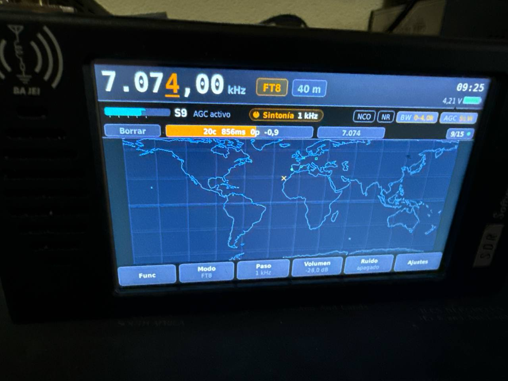
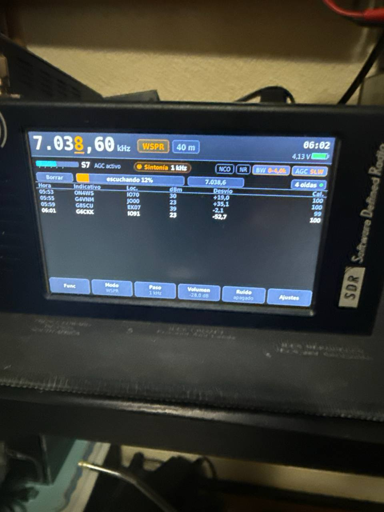
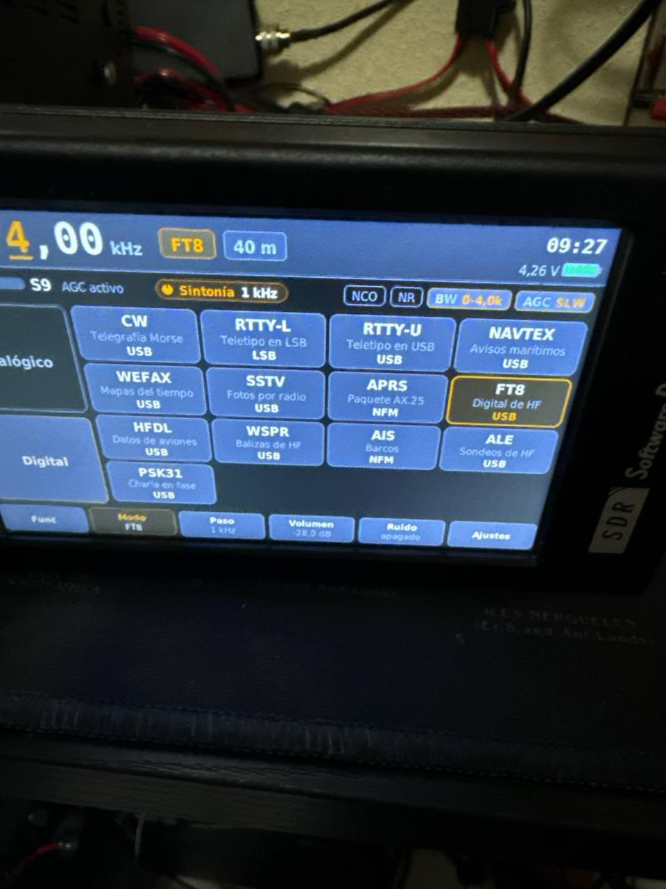
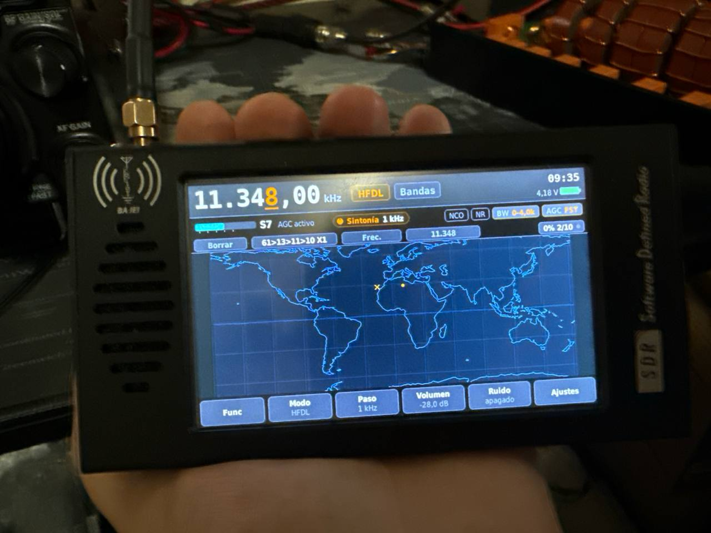
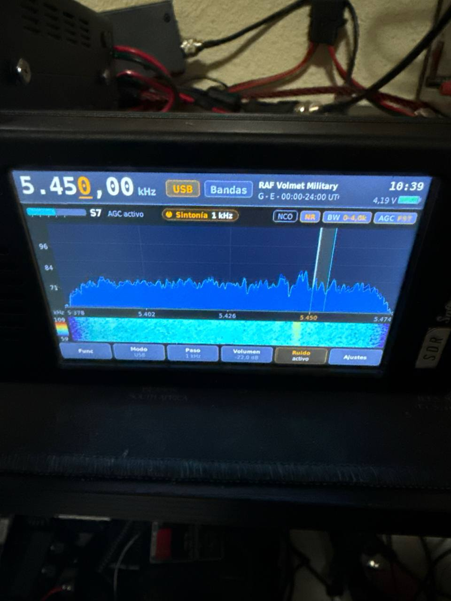
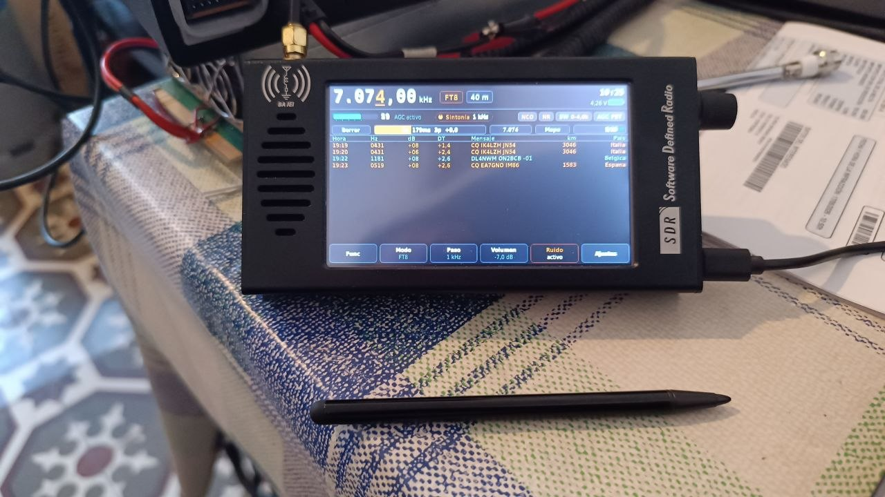
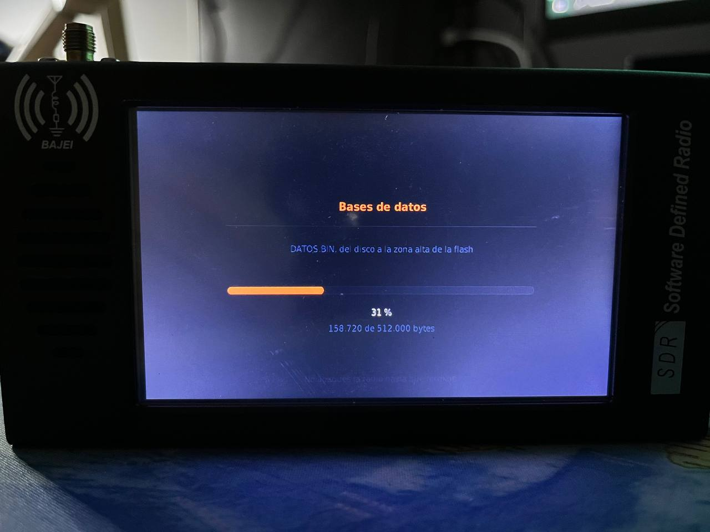
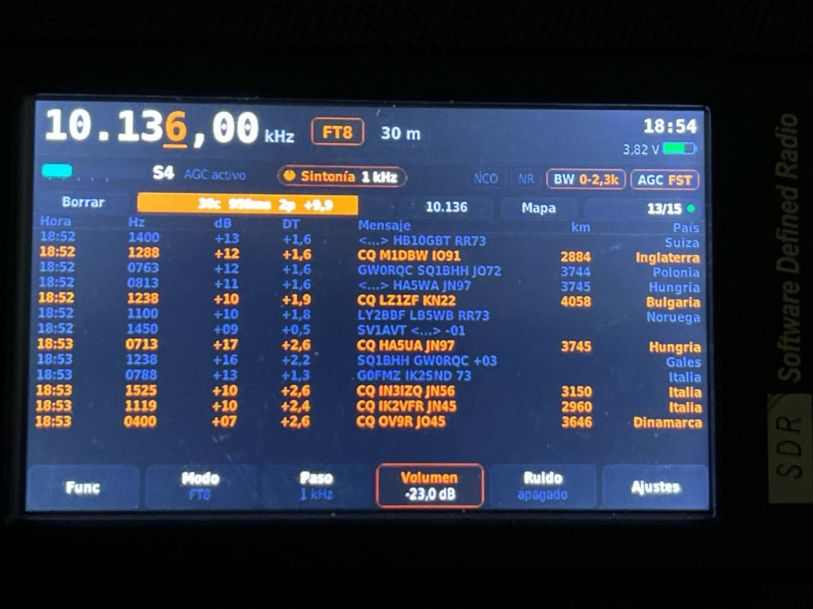
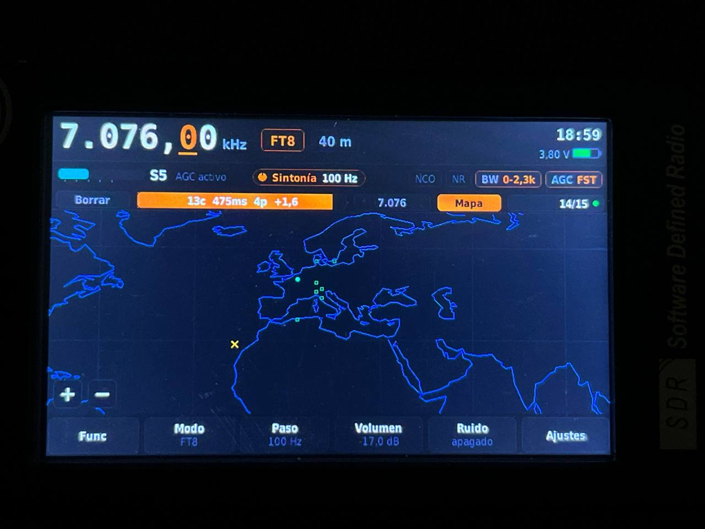
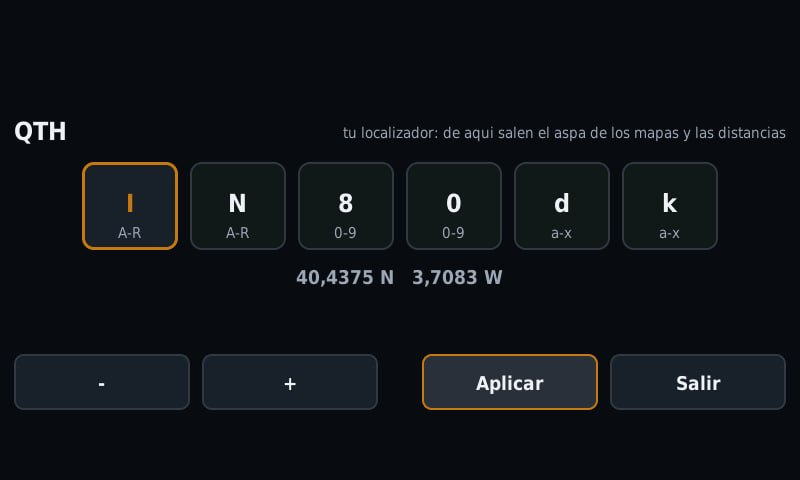

In memory of Carlos EB4DYL

# DEEPSDR 101 / HTOOL/ BAJEI SDR V5 GD32F450 Open Source Firmware

This project is a collaboration between EA8DGL Esteban, UA6YKK Alexandr and 
EA7GIB Blas, aiming to create open firmware for the DEEPSDR 101 and BAJEI SDR V5 
clone with the GD32F450 MCU. 

It is currently in the development phase, and programming is being carried 
out primarily using AI. The current version is functional and supports most 
DEEPSDR radio features.

We would welcome any collaboration or assistance with its development. 
Regards.












## Disclaimer

This firmware is provided **"as is"**, without warranty of any kind,
express or implied, including but not limited to warranties of
merchantability, fitness for a particular purpose, and
non-infringement.

This is a hobbyist, experimental project. Flashing this firmware onto
your hardware, and any hardware modifications you make in order to
use it (wiring, GPIO changes, RF front-end changes, etc.), are done
**entirely at your own risk**. The author assumes no responsibility
and accepts no liability for any damage, malfunction, data loss, or
other harm to your equipment - or to any other equipment, property,
or person - resulting from downloading, building, flashing, modifying,
or otherwise using this firmware, whether used as-is or altered by you
or any third party.

You are solely responsible for:
- Verifying that this firmware is suitable for and compatible with
  your specific hardware before flashing it (check that your mcu is
  the GD32F450VET6/VGT6!!!).
- Complying with all applicable radio spectrum, transmission, and
  equipment regulations in your country/region. (This firmware
  targets a *receiver* - it is not designed or intended to transmit -
  but it is still your responsibility to ensure your use of it, and
  of the underlying RF hardware, is fully compliant with local law.)
- Any consequences of modifying, adapting, or redistributing this
  firmware, including modifications made by you or by anyone else who
  obtains it from you.

No support, maintenance, or fitness for any particular use case is
guaranteed. Use of this project constitutes acceptance of this
disclaimer.

## Overview

This document covers three things deliberately kept separate from the
hardware/clock-tree description: what the project is, how to build
and flash it (both the ST-Link/OpenOCD workflow and the vendor
bootloader's `update4.bin` workflow), and exactly how the current menu
system and general UI behave. It reflects the UI/menu state as of
01/09/2026 — several tiles referenced here were added or moved during
that session; if the hardware doc still shows an older 3-page menu
with only a handful of tiles, this file supersedes it for anything
UI-related.

## 1. Project

This is a collaborative, hobbyist, bare-metal firmware project
targeting the GD32F450VET6 MCU used in the DEEPSDR 101 / BAJEI SDR V5
receiver boards — a direct-sampling QSD (Quadrature Sampling Detector)
SDR receiver with an 800x480 touchscreen. No RTOS; direct register
access via GigaDevice's standard peripheral library where it matters
(clocks, DMA, I2S, timers).

The project is in active development, programmed primarily with AI
assistance under the project owner's direction, with real-hardware
verification (oscilloscope, real reception tests) driving essentially
every design decision — nothing in the clock tree, RF chain, or DSP
path is trusted on paper alone; the commit/comment history throughout
the source consistently documents what was actually confirmed on the
bench versus what's still an assumption.

It currently supports AM, USB, LSB, NFM, and WFM reception, a
touch-driven panadapter/waterfall display with drag- and tap-to-tune
gestures, a paged settings menu covering RF/audio/display/digital-mode
options, RTTY decoding, a selectable AM/USB/LSB/NFM sample rate
(96kHz/48kHz — see 3.9), and a growing set of diagnostic and
quality-of-life tools (manual/auto AGC, selectable audio and channel
filter widths, spectrum auto-scaling, a calibrated S-meter dBm readout
(see 3.8), and a GD32-generated quadrature LO path for the lowest
tuning range where the board's MS5351 clock generator can't reliably
hold quadrature).

## 2. Building and Flashing

### 2.1 Prerequisites

```sh
sudo apt install gcc-arm-none-eabi openocd
```

### 2.2 Build

```sh
make            # build build/firmware.elf / .hex / .bin
make clean      # remove build artifacts
```

### 2.3 Flashing via ST-Link (OpenOCD)

This is the direct, debugger-based flashing path — used for
development, and for any board with an accessible SWD header.

```sh
make flash      # flash + verify + reset via OpenOCD
make erase      # mass-erase the chip via OpenOCD
```

Both targets use `openocd/gd32f450.cfg` — a **custom** target config,
not the stock `target/stm32f4x.cfg` that ships with OpenOCD. This
matters: the GD32F450's silicon ID makes OpenOCD misdetect it as a
dual-bank 2048KB STM32F42x/43x part, when the real part is a 512KB
single-bank device. Flashing with the wrong target config produces
`Error: checksum mismatch` after programming — if that happens, check
that the custom `.cfg` is actually the one being used, not a stock
STM32F4 profile.

Debugging in VS Code: with the Cortex-Debug extension installed
(suggested automatically via `.vscode/extensions.json`), pressing F5
launches the "Debug GD32F450 (OpenOCD + ST-Link)" configuration
already set up in `.vscode/launch.json`.

### 2.4 Update and flashing via bootloader.

[HOWTO](DeepSDR_Reload_Install_HOWTOl_ES_EN.pdf)

### 2.5 Which method to use

- **ST-Link/OpenOCD**: use during development, for any board with an
  accessible SWD header, or when something has gone wrong badly enough
  that the vendor bootloader itself might not be trustworthy (e.g.
  recovering from a bad flash).
- **`update4.bin`**: use for a normal end-user-style update on a board
  that's already running some firmware and boots into its vendor
  bootloader normally — no debugger needed.

### 3 Known RF quirks: internal-clock birdies

This board's own internal clock sources can and do produce birdies
(spurious tones from digital clock harmonics leaking into the RF
front end) — worth knowing about before chasing what looks like an
external interference source that's actually coming from inside the
receiver itself. Three separate clock domains are involved, each a
potential source of its own family of harmonics:

- **The MS5351/Si5351 LO generator's 26MHz reference crystal**
  (`ms5351.c`) — this drives the receiver's own local oscillator via
  PLLA/PLLB, so any of its own harmonics or PLL artifacts land
  wherever the current tuning happens to put them, moving with the
  VFO rather than sitting at one fixed spot.
- **The audio codec's 12.288MHz crystal** (`gd32_i2s.c`/`aic3204.c`) —
  the reference for MCLK and, downstream, the codec's own internal
  PLL (CODEC_CLKIN, currently 86.016MHz — see `aic3204.c`'s clock-
  chain comment) that ultimately produces the I2S bit clock and
  sample rate.
- **The I2S/sample-rate clock itself** — and this is the one with a
  **confirmed, on-the-bench** birdie: at 96kHz (AM/USB/LSB/NFM's
  previous fixed rate), the 287th harmonic of the sample rate
  (287 × 96kHz = 27.552MHz) lands squarely in the 11m/CB band,
  reproduced on both a modified and an unmodified board (ruling out a
  power-rail coupling issue specific to one unit). Since this harmonic
  number scales with whatever the sample rate actually is, switching
  rate moves the whole comb of harmonics to different frequencies —
  which is exactly why the **RATE tile** (HW page, 96K/48K) exists:
  moving Fs relocates this class of birdie to a different, hopefully
  less troublesome, spot rather than eliminating it outright. The
  same reasoning applies to WFM's own fixed 192kHz rate, which has its
  own comb of N×192kHz harmonics somewhere — not separately confirmed
  on the bench the way the 96kHz case was, but expected by the same
  mechanism, and not user-selectable the way AM/USB/LSB/NFM's rate is
  (WFM is always 192kHz).

None of these birdies are a firmware bug in the sense of something
this project can filter or calibrate away — they're consequence of
real clock energy on the same board as a sensitive front end. The
practical mitigations available today are: retuning slightly (the LO
harmonics move with the VFO), or trying the other sample rate via the
RATE tile (the I2S-clock harmonics move with Fs). If a stronger fix
(shielding, decoupling, a cleaner reference clock) is ever pursued,
it belongs in the hardware document rather than here.